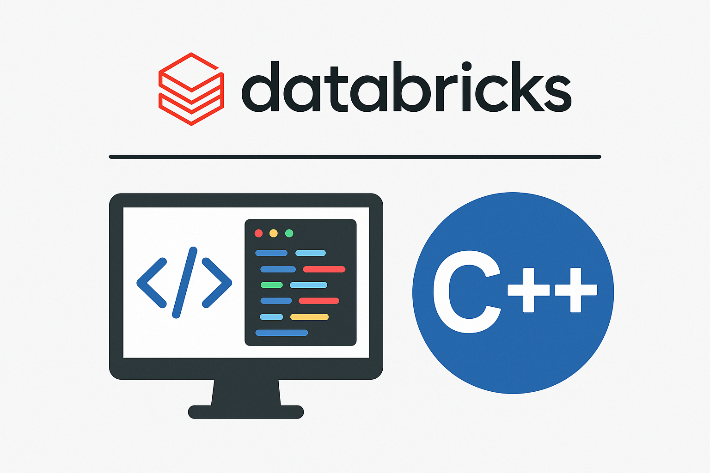

# Databricks C++ SDK

---

# Documentation
The complete Doxygen documentation is available at: [calvinjmin.github.io/databricks-sdk-cpp](https://calvinjmin.github.io/databricks-sdk-cpp/)

# Contribution

Please see the contribution guide [here](./CONTRIBUTING.md) for information on how to contribute to the project.

# License

MIT License - see [LICENSE](./LICENSE) file for details.
